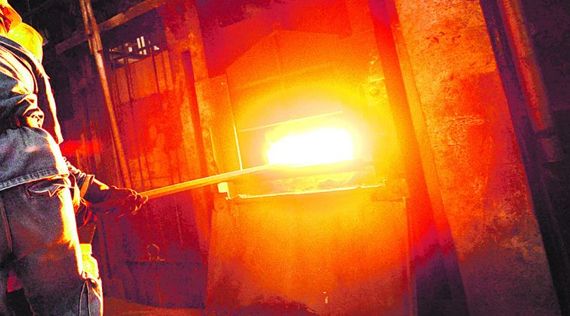

# Tin Mining in China 

Despite China being home to more than 30 percent of global tin reserves, we rarely hear about China and tin mining (Reportlinker). In fact, China is both the biggest producer and consumer of tin. Most Chinese miners are artisanal miners - China's rural mining economy includes up to 120 million workers and produce at least 30 percent of China's tin output by volume. These miners derive the majority of their income from mining but are categorized as farmers by the government. Many mines pause operations for 10 day periods around planting and harvesting to allow labourers to tend to crops.  Miners' tie to the land make it difficult for the workforce to relocate to new mines, but full reliance on farming provides insufficient income (Gunson).

Industrialized mines in China are either state-owned and privately held. State-owned mines tend to have slightly stricter environmental standards and are subject to emission caps. Mines are licensed through a decentralized system, and licenses tend to be treated as a formality (Gunson). 

China is also home to a large number of smelters which also service other tin-mining countries in Southeast Asia.  Those smelters are  required to abide by increasing pollution regulation.  In 2016, official environmental inspections led to smelters shutting down while improvements were made to meet industry standards. These temporary shutdowns impacted the smelters that account for 45% of China’s annual tin production (Burton). 

 An image of a tin smelter (Itri).

Because of its large manufacturing industry, China is both the largest producer and consumer of tin and it is a net importer of tin - as of 2015, China imports approximately 40 percent of its total tin supply for manufacturing (Yang). Recent market trends show China’s tin sector tightening.  As more tin is extracted in the county, lower grade tin that is buried deeper in the earth is getting mined.  This leads to a worse quality tin with increased mining cost ("Mixed").  In fact, if China were only to rely on internally-produced tin, it would exceed its known reserves by 2032 - as a result, China both imports a great deal of tin and invests in material recovery methods. About 95% of tin coming into China was mined in Myanmar (Gunson, "Mine").

## Tin Mining In Other Regions
Learn more about tin mining in other regions at the links below:

[Tin Mining in Indonesia](https://anushadatar.github.io/conflict/Tin-Mining-in-Indonesia.html)

[Tin Mining in Myanmar](https://anushadatar.github.io/conflict/Tin-Mining-in-Myanmar.html)

## Citations
Burton, Melanie. “Pollution Crackdown on China Tin Producers Could Spur Imports, Lift Prices.” Reuters, Thomson Reuters, 9 Aug. 2016, www.reuters.com/article/us-metals-tin-smelters/pollution-crackdown-on-china-tin-producers-could-spur-imports-lift-prices-idUSKCN10K0G. 

Gunson, AJ, and Yue Jian. Artisanal Mining in The People's Republic of China. 2001, Mining, Minerals, and Sustainable Development, pubs.iied.org/pdfs/G00719.pdf.

Itri. “Falling Tin Prices Prompt Chinese Smelters to Reduce Production,United States.” ScrapMonster, ScrapMonster, 22 Aug. 2019, www.scrapmonster.com/news/falling-tin-prices-prompt-chinese-smelters-to-reduce-production/1/72508.

“Mine Accident Further Tightens Chinese Tin Market.” International Tin Association, 7 Nov. 2019, www.internationaltin.org/mine-accident-further-tightens-chinese-tin-market/.

“Mixed Outlook for China's Tin Production and Global Analysis.” International Mining, 21 Sept. 2017, im-mining.com/2017/09/22/mixed-outlook-chinas-tin-production/.

Reportlinker. “Research on Global and China Tin Industry, 2013-2017.” PR Newswire: Press Release Distribution, Targeting, Monitoring and Marketing, 29 June 2018, www.prnewswire.com/news-releases/research-on-global-and-china-tin-industry-2013-2017-212781501.html.

Yang C, Tan Q, Zeng X, Zhang Y, Wang Z, Li J. Measuring the
sustainability of tin in China. Sci Total Environ, 
2018;635:1351–9.