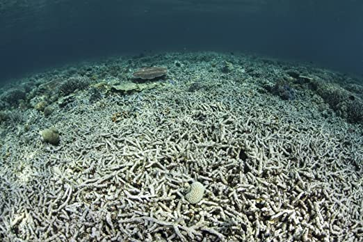
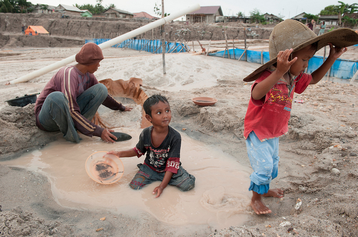

# Tin Mining in Indonesia

Indonesia is one of the world’s leading tin producers (meaning it is one of the countries that mines the most tin). Most tin reserves and tin production in Indonesia is spread throughout its western islands (Bangka, Belitung, Singkep, and Karimun Kundur), “The Indonesian Tin Islands” (Rosyida). Despite being one of the world's leading tin producers, Indonesian tin mining is still quite unsafe, and ruled over primiarily by other countries, often leaving miners with poor regulations, and pay.

Indonesian mining relies mainly on foreign investment - mining regulation is largely decentralized such that the individual regions handle national resource utilization and permissions for mining - regulations require companies to do environmental analysis and pay royalties, but it is not necessarily sufficient to protect workers. Indonesia has extensive tin mines and smelting capabilities.

The impacts of foreign investment and industrial processes can have an outsized impact on  communities. For example, foreign investors will develop suction dredging systems that help automate the extraction process at scale. This can create issues because such processes deplete resources and harm the environment, reducing job opportunities for those who subsist off of engaging in local mining and fishing/farming work. At the same time, local governments tend to grant permits for such processes (generally in exchange for compensation) - as artisan miners generally operate without permits, they experience additional difficulty, even if the presence of increased mining activity has positive impacts on the overall development of the area. In fact, eighteen out of the thirty-one coral reefs in the area were severely damaged from tin mining sediments between 2007 and 2011 (Rosyida).

An image of some of the destroyed coral reefs in Indonesia (“Posterazzi")

Additionally, in Indonesia, mining is overseen at the regional level. This means different licensing practices and environmental precautions take (or don’t take)  place in different regions, and license holders have to pay royalties to their governing body (Rosyida). A large number of residents operate on unlicensed mining operations, which often take place in protected and unsanctioned areas of the island ("Casualties"). Unfortunately, these state regulations have no guarantee that mining activity will benefit a community, leading to many mining communities being impoverished and environmentally damaged (Rosyida). The net fishing industry, previously a huge economic staple of the islands, was greatly damaged after the approval of suction dredging operations off of the coasts. While the decision was put to a vote, about 72% of the net fishers who voted to allow the suction operations actually disagreed with the choice but were either given compensation for or pressured to vote in its favor or just felt too insecure to vote otherwise (Rosyida).

Due to the lack of safety equipment, training, and regulation, accidents are very common ("Casualties"). The pits that miners draw ore from are generally poorly constructed and prone to collapse, sometimes burying divers under meters of sand ("Casualties").  If there is a fatality or harmful accident, families receive no compensation or assistance, making the mining business a risky one. Child labor is also very common, kids as young as 14 working as fulltime miners ("Casualties"). Child labor is so common, that the Bangka Belitung province has the second highest student drop out rate ranging from elementary school all the way to high school (Nurtjahya).

Image of child labor in Indonesian mine ("Impacts").

## Citations

“Casualties of Ore: Tin Mining Is Devastating the Indonesian Island of Bangka.” South China Morning Post, 13 Apr. 2014, www.scmp.com/magazines/post-magazine/article/1473532/casualties-ore-tin-mining-devastating-indonesian-island.

“Impacts of Tin Mining.” Tin Mining in Indonesia, 11geokatieevans.weebly.com/impacts-of-tin-mining.html.

Nurtjahya, Eddy, et al. Https://Www.matec-Conferences.org/Articles/Matecconf/Pdf/2017/15/matecconf_sicest2017_04010.Pdf. 2016, www.matec-conferences.org/articles/matecconf/pdf/2017/15/matecconf_sicest2017_04010.pdf.

“Posterazzi A Coral Reef Has Been Destroyed in Indonesia.” Google Images, Google, images.google.com/.

Rosyida, Isma, and Sasaoka Masatoshi. “Local Political Dynamics of Coastal and Marine Resource Governance : A Case Study of Tin-Mining at a Coastal Community in Indonesia.” Science Direct, Hokkaido University, 2018, www-sciencedirect-com.olin.idm.oclc.org/science/article/pii/S2211464517302488?via%3Dihub.

