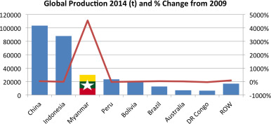
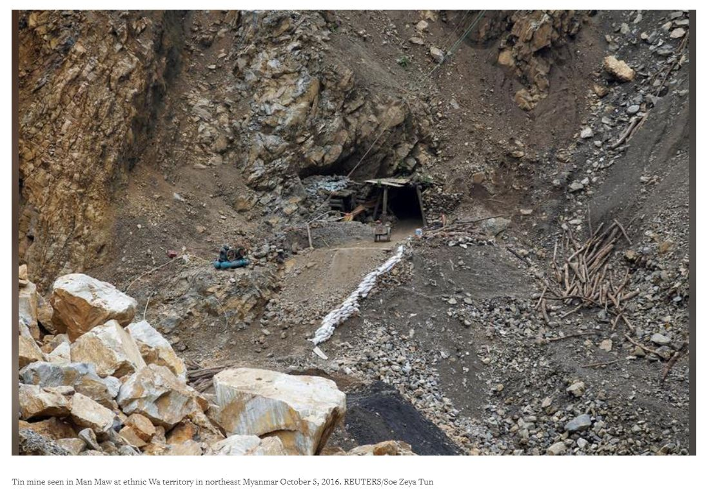

# Tin Mining in Myanmar
Tin mining has recently grown very quickly in Myanmar. By 2014, Myanmar established itself as the third largest producer of tin after having increased production almost 5000 percent over 5 years. Myanmar has large deposits of tin associated with the granite belts in Southeast Asian that account for 50 percent of tin produced globally. Unfortunately, Myanmar tin mines are also primarily run by local militia and armies that are not government sponsored. This creates for a lot of dangerous conditions within mines, as well as harsh control and poor paying of miners.

Tin mining has existed in Myanmar since medieval times, though it escalated when Myanmar was under British control in the early 20th century and the mines industrialized and produced tin and tungsten for the first world war. Following the second world war (after both Japanese and Allied occupation), Myanmar became an independent nation and adopted a nationalized economic model isolated from the rest of the world - as a result, all mines fell under government control and started to decline in the face of other  priorities. Myanmar allowed foreign investment in the mining industry in 1988, and since then, the discovery and use of new tin deposits has fueled an increase in mining. 

 
Graph indicating the rise in Myanmar's tin mines on the global market. (Gardiner)

Due to relatively poor processing methods and the nature of the deposits present, the extracted cassiterite tends to be low in tin concentration and tends to have a high tungsten concentration. To resolve this issue, magnetic separation plants clean up the concentrate - if separated properly, tungsten is a valuable byproduct.

Myanmar does not have large-scale smelting capabilities, so most of the tin extracted is shipped elsewhere (usually Thailand, Malaysia, or China) for smelting. In fact, China imports 95% of its tin ore from Myanmar, though it requires that the tin ore pass through a generally illegal supply chain to make it to Chinese smelters ("Myanmar"). Much of the supply chain is illicit because of the lack of government regulations to ensure otherwise. Thus, often, even if it seems like a tin source is getting its tin from China, the tin has actually come over from Myanmar. A majority of the tin that gets exported to China comes from territory controlled by the United Wa State Army (USWA), one of the strongest militias in Myanmar ("Myanmar"). The USWA, has been flagged by the US for its drug trafficking, thus many companies are afraid to get their tin from this area in fear of being accused of supporting the non-state army ("Myanmar"). There is a fair amount of corruption fueled labor and human trafficking directed by the USWA running the tin mines.

Image of tin mine within USWA territory. (Lee)

On an environmental level, many of these poorly-equipped mines have been called out for water pollution and deforestation caused during the hunt for tin ore ("Myanmar").

## Tin Mining In Other Regions
Learn more about tin mining in other regions at the links below:

[Tin Mining in China](https://anushadatar.github.io/conflict/Tin-Mining-in-China.html)

[Tin Mining in Indonesia](https://anushadatar.github.io/conflict/Tin-Mining-in-Indonesia.html)

## Citations
Gardiner, Nicholas J., et al. “Tin Mining in Myanmar: Production and Potential.” Resources Policy, Pergamon, 29 Oct. 2015, www.sciencedirect.com/science/article/abs/pii/S0301420715000938.

Lee, Yimou. “How a Rebel Myanmar Tin Mine May up-End a Global Supply Chain.” Reuters, Thomson Reuters, 3 Dec. 2016, www.reuters.com/article/uk-myanmar-tin-insight/how-a-rebel-myanmar-tin-mine-may-up-end-a-global-supply-chain-idUKKBN13N1XY.

“Myanmar's Tainted Tin Is Entering Company Supply Chains.” Verisk Maplecroft, 2017, 10 October. www.maplecroft.com/insights/analysis/myanmars-tainted-tin-is-entering-company-supply-chains/.

