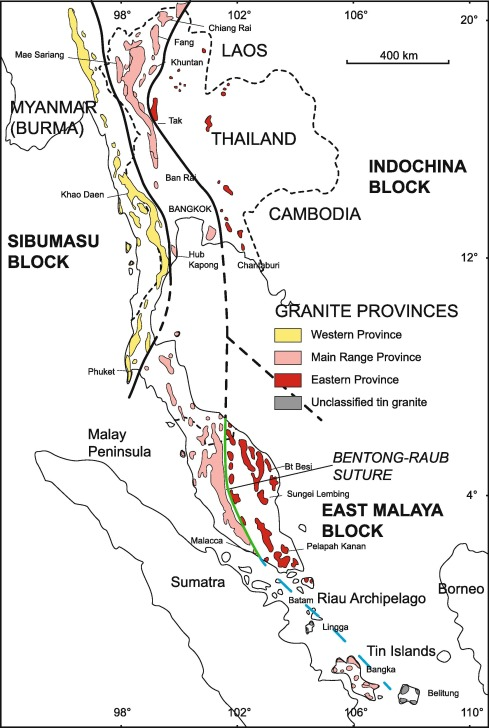

# Tin Mining in Southeast Asia and China

About 75% of the world's tin production and mining occurs in the Southeast Asian Tin Belt, which "is a north-south elongate zone 2800 km long and 400 km wide, extending from Burma (Myanmar) and Thailand to Peninsular Malaysia and the Indonesian Tin Islands" (Schwartz). Below is a map of the Southeast Asian Tin Belt:

(Ng)

Within the Southeast Asia belt, the largest producers are Indonesia and Myanmar. Within these three largest producers, there is a fair amount of illegal trade, particularly involving mined tin from Myanmar sent to China to be fully processed. The vast majority of the tin imported by China comes through this trade. Despite the vast majority of tin mining happening in this general region, most discussion and regulation of tin mining outside of the Democratic Republic of the Congo (DRC). Presumably, this is because much of the DRC’s mining industry is corrupt and unregulated. However, the same is true in Southeast Asia and China, where much more tin is produced: corruption, a lack of safety equipment and regulation, and militia-run mines still exist.

To read more about tin mining in these particular regions, check out the links below:

[Tin Mining in China](https://anushadatar.github.io/conflict/Tin-Mining-in-China.html)

[Tin Mining in Indonesia](https://anushadatar.github.io/conflict/Tin-Mining-in-Indonesia.html)

[Tin Mining in Myanmar](https://anushadatar.github.io/conflict/Tin-Mining-in-Myanmar.html)

# Citation

Ng, Samuel Wai-Pan, et al. “Late Triassic Granites from Bangka, Indonesia: A Continuation of the Main Range Granite Province of the South-East Asian Tin Belt.” Journal of Asian Earth Sciences, Pergamon, 3 Mar. 2017, www.sciencedirect.com/science/article/abs/pii/S1367912017300998.

Schwartz, and Djaswadi. “The Southeast Asian Tin Belt.” NASA/ADS, ui.adsabs.harvard.edu/abs/1995ESRv...38...95S/abstract.
