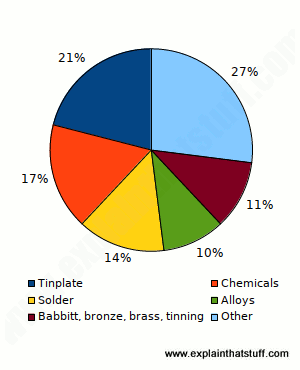

# Properties of Tin
Tin has a few technical properties that make it a commonly used conflict metal. Tin has a low melting point which makes it desirable for products like soldier because it can easily be melted and then used as a binding agent for other metals. Along these lines, tin is super malleable, so it can easily be worked into sheets, and ductile, so it can be worked into wire. Most commonly, we see tin used as a coating on other metals because tin is corrosion and rust resistant, and has a very low reactivity, which makes it a good protectant of the metal underneath. 

Here is a chart expressing the most common uses of Tin:

The versatility of tin can easily be expressed through the diverse range and uses of its alloys. One of the most common tin alloys is bronze (CuSn) - used for spark resistant tools, springs, wire, electrical devices, water gauges, etc. But we also see Tin alloys in things like toothpaste -- tin fluoride (SnF2) and tin pyrophosphate (Sne2P2O7) which can help fight cavities. Type II Superconductors use Niobium Tin (Nb3Sn), Tin Oxide (SnO2) is used in glass, cosmetics, polishes, and Tin Chloride (SnCl2) is used in dyes, textiles, mirrors, and food preservatives. 

The most common substitute for tin is aluminium -- it’s cheaper and has similar properties. For example, we now use Al instead of tin in “tinfoil” which used to be tinplated steel, and tin cans are now just Al.

# Tin Mining

## The Tin Mining Process
Humans have used tin since ancient times. Tin is a key component in bronze (a combination of tin and copper). Initially, the tin present in bronze likely came from existing impurities in the copper, then became a key component necessary to harden the metal and make it easier to cast.

Generally, natural tin exists in the form of cassiterite (SnO 2). Cassiterite mining requires dredging alluvial deposits using high-pressure water, an excavator, and/or hard-rock mining methods. Once extracted, producers concentrate the ore to 70-77 percent tin through flotation, gravity, and magnetic processes. All of these processes generally occur at the same site as the mine.

Then, after shipping the concentrated tin ore to the smelter, producers heat the tin with carbon to between 1200 and 1300 degrees Celsius. This process releases carbon dioxide and leaves tin metal behind. After smelting, tin goes through the refinery (which is usually co-located with the smelter), which heats tin above its melting point such that the impurities remain solid as the tin becomes a liquid - this slag often contains other conflict minerals such as tantalum. If the refinery uses carbon-based fuel furnaces, the resulting metal can be up to about 99.85 percent tin. Electrolytic processes, which use electrodes to heat the concentrate, can produce 99.9999 percent tin.

## The Context of Tin Mining
The majority of tin smelters, along with tin mines, are located in China and Indonesia. China and Indonesia dominate the tin production market, though nations such as Malaysia, the Democratic Republic of the Congo, Brazil, Bolivia, and Peru also produce large quantities of tin. About forty percent of tin is mined through artisanal methods, which involve small-scale informal processes with individual miners. Artisan-scale miners generally mine by hand and work independently instead of for a mining company.

## Human Health Impacts of Tin Mining
Exposure to large quantities of tin has links to neurological problems, damage to the immune system, respiratory irritation, skin and eye irritation, and gastrointestinal effects. Some of these problems persist long after exposure to the material. These damages have the strongest impact on those engaging in artisan-scale mining. Artisan-scale mining also often involves child labor, and tin exposure can have more drastic negative impacts on youth. 

Areas in close proximity with tin mines and smelting areas are very likely to be contaminated with neurotoxic metals, causing health problems not only for workers, but also residents in the area. Often the smelting process is done in make-shift sheds outside of workers’ homes, bringing the dangers even closer to home. The fumes and dust from mining and smelting is directly correlated with a high rate of neurodevelopmental delays like behavioral problems in children[1]. 

Tin mining itself also shapes the ecosystem outside of the mine - mining generates erosion and pollutes the soil and air. The tools used for mining generate noise pollution and can cause larger sedimentation issues as well. 

# Legal Context of 'Conflict Metals'
In 2010, the United States Dood-Frank act passed and included provisions to regulate the 3TGs (tin, tantalum, tungsten, and gold) that armed groups in the Congo were using to finance ongoing regional conflict.  

# Citations
[1] Marques, Rejane, et al. “Role of Methylmercury Exposure (from Fish Consumption) on Growth and Neurodevelopment of Children Under 5 Years of Age Living in a Transitioning (Tin-Mining) Area of the Western Amazon, Brazil.” Archives of Environmental Contamination & Toxicology, vol. 62, no. 2, Feb. 2012, pp. 341–350. EBSCOhost, doi:10.1007/s00244-011-9697-4.
