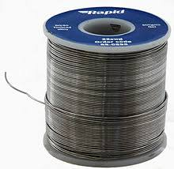
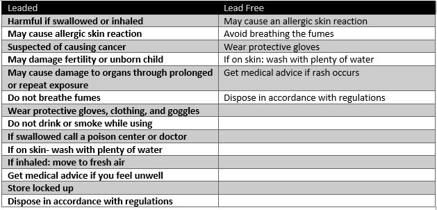
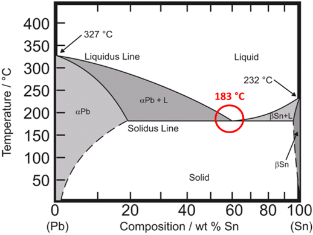
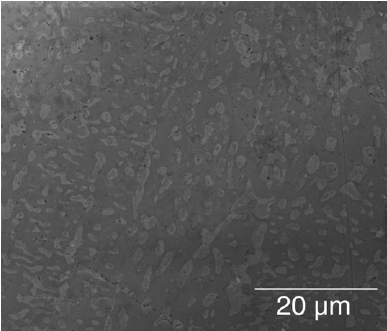
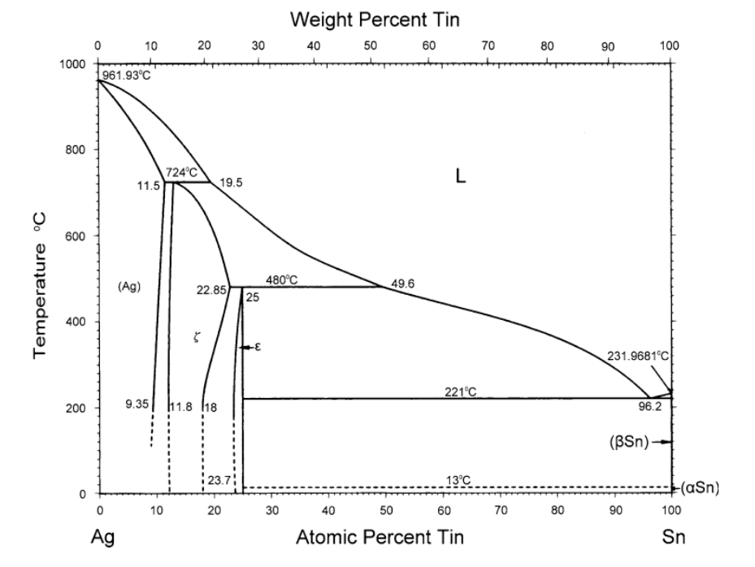
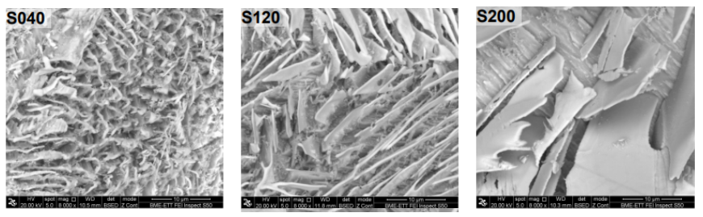

# Tin and Solder
 ("Solder")
## Solder Overview
A common use case for Tin is solder. Solder is used in almost every electronic product, as it’s how circuit components are physically and electrically connected to both each other and the circuit board. Aside from circuitry, solder is often used in pipes, welding, sheet metal, making stained glass, etc ("Solder"). Solder is useful in that it can be melted, and flexibly moved, but once it is dried, the bonds it forms are strong.

Initially, solder had a strong lead core. Usually in ratios of between 65-50 parts tin, and the remaining parts lead ("Solder"). However, after the health risks of lead were discovered, the industry switched over to using mostly lead-free solder. Lead-free solder is usually made using alloys of tin with elements such as silver (Ag) and copper (Cu) (Posch). The debate over lead-free versus leaded solder is ongoing. Some argue that leaded solder works better: Leaded solder heats up at a lower temperature than lead free solder, is cheaper than lead free solder, and dries shiny- making it easy to spot oxidation issues,etc ("Difference"). However, the health risks of leaded solder are hard to ignore. Below is a table summarizing the health risks of using each:

 (Hencke).

These differences are shaped by the chemical properties and specific impacts of each kind of solder.

## Leaded Solder
### Chemical and Thermal Properties
In the past lead-based solder was industry standard  for plumbing and electrical application but greater understanding of the risk associated with lead product has caused this type of solder to be phased out.  Lead-based solder has been prohibited joints for plumbing systems since the 1980s (Posch).  In 2006, the European Union has functionally prohibited lead-based solder in consumer electronics
The most common forms of lead based soler are 60-40 and 50-50 tin-lead mixtures ("Solder"). 60-40 is closed to the eutectic composition of tin-lead meaning the substance has a low melting point.  The narrow range in which it melts and solidifies makes it well suited for electrical work.  50-50 tin-lead solder is able to melt and freeze over a larger range of temperatures.  It freezes around 220 degrees celsius and solidifies at 183 degrees.  This means the mixture is workable for a longer period of time which makes it useful from plumbing applications.

The phase diagram indicates that at ~63% tin and ~37% lead composition the mixture freezes and melts at the 183 degrees celsius.  This type of solder used in electrical application melts beginning at 183 and is fully liquid at 191.  When the liquid solder is cooling and crosses the eutectic point two solids are formed (a Pb solid and a Sn solid).

 (FCT)

In the SEM micrograph of a SnPb solder joint, the alternating layers of solid are indicative of a euctectic composition in solid form. Those layers are distributed by atomic diffusion and the dark regions are rich in tin, while the light regions are rich in lead.  

 (Siviour et. al)

### Sustainability and Impacts
Lead-based solder has both an environmental impact as well as a human-health risk.  Soldering produces fine particles of solder that can be inhaled or accidentally ingested by individuals soldering (Hencke).  Lead based plumbing systems can introduce lead into a building water source have particularly serious health consequences for children.  In electrical applications, lead in e-waste can get leached into groundwater and soil.  

## Lead Free Solder
### Chemical and Thermal Properties
There are several notable lead-free solder compounds that combine tin with other metals such as silver (Ag), copper (Cu), zinc (Zn), bismuth (Bi), indium (In), and antimony (Sb). One common alloy is Sn-Ag, or Tin and Silver, which has the following phase diagram (Chen). 
 (Hencke)

The phase diagram indicates that tin and silver form a eutectic solid at 220.9 °C and 3.87% Ag - at this point, the solution will be a liquid. While this point is higher than the melting point of tin-lead solders, it is still within range for most manufacturing processes. The solid that forms right below the melting point at 3.5% Ag has the following microstructure depending on the cooling rate - the image labeled S040 cooled at -6.6 °C/second, the image labeled S120 cooled at -2.0 °C/second, and the image labeled S200 cooled at -0.3 °C/second. Faster cooling leads to a finer structure with smaller grain sizes of dendritic tin, while slower cooling leads to plate-like microstructures and larger grain sizes (Hurtony).
 (Hencke)

### Sustainability and Impacts
Lead-free solder is significantly less toxic to the environment than leaded solder is. One of the most notable damages caused by the disposal of printed circuit boards is lead leeching, so eliminating leaded solder from printed circuit boards mitigates that effect (Park). That being said, the production and disposal of tin and the replacement alloy has associated overhead as well that cannot be disregarded just because lead is far worse.

# Conclusion
The chemical properties and use cases of both leaded and unleaded solder has significant impacts both on electronic products themselves and the human lives and systems impacted by their production, use, and disposal.

## Sources 
Chen, Sinn-Wen & Wang, Chao-Hong & Lin, Shih-kang & Chiu, Chen-Nan & Subramanian, K.. (2007). Phase Diagrams of Pb-Free Solders and Their Related Materials Systems. 10.1007/978-0-387-48433-4_2. 

“Difference Between Lead and Lead Free Solder.” Pcboardrework, 13 July 2016, www.pcboardrework.com/difference-between-lead-and-lead-free-solder/.

FCT. “Eutectic Solder.” Solder Paste, Solder Flux - FCT Solder, fctsolder.com/eutectic-solder/.

Hencke, Ben. “A Hill to Die On - Why Lead Free Solder Is Better For You.” Ben Hencke, Ben Hencke, 15 Mar. 2019, www.bhencke.com/blog/2019/3/15/a-hill-to-die-on.

Hurtony, Tamás & Szakál, Alex & Almásy, László & Len, Adél & Kugler, Sándor & Bonyár, Attila & Gordon, Peter. (2016). Characterization of the microstructure of tin-silver lead free solder. Journal of Alloys and Compounds. 672. 10.1016/j.jallcom.2016.02.177.

Park, Y.J., Fray, D.J., 2009. Recovery of high purity precious metals from printed circuit boards. Journal of Hazardous Materials 164, 1152e1158

Posch, Maya, et al. “Lead-Free Solder Alloys: Their Properties And Best Types For Daily Use.” Hackaday, 28 Jan. 2020, hackaday.com/2020/01/28/lead-free-solder-alloys-their-properties-and-best-types-for-daily-use/.

Siviour, Clive & Walley, S.M. & Proud, W & Field, J. (2005). Mechanical properties of SnPb and lead-free solders at high rates of strain. Journal of Physics D: Applied Physics. 38. 4131. 10.1088/0022-3727/38/22/018. 

“Solder.” Wikipedia, Wikimedia Foundation, 19 Apr. 2020, en.wikipedia.org/wiki/Solder.

